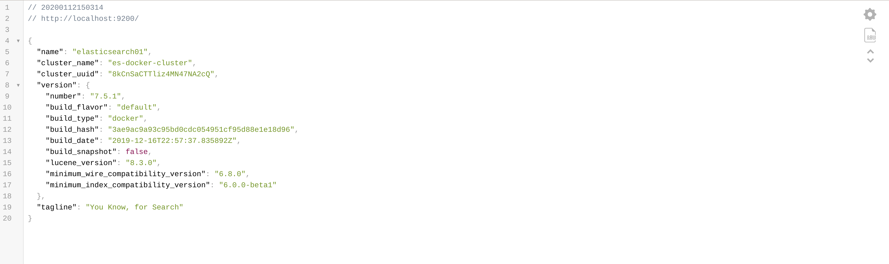

1/ Increase vm.max_map_count kernel setting value on the server(laptop) where you are going to run this example
The vm.max_map_count setting should be set permanently in /etc/sysctl.conf:
```
grep vm.max_map_count /etc/sysctl.conf
vm.max_map_count=262144
```
To apply the setting on a live system, run:
```
sudo sysctl -w vm.max_map_count=262144
```

2/ Start elasticsearch with multi nodes

```
$ docker-compose -f docker-compose-multi-node.yml up -d
Creating network "elasticsearch_network" with the default driver
Creating volume "elasticsearch_elasticsearch01-data" with default driver
Creating volume "elasticsearch_elasticsearch02-data" with default driver
Creating volume "elasticsearch_elasticsearch03-data" with default driver
Creating elasticsearch03 ... done
Creating elasticsearch02 ... done
Creating elasticsearch01 ... done
```

3/ Check that elasticsearch multi nodes are up and running
```
$ docker-compose -f docker-compose-multi-node.yml ps
     Name                    Command               State                Ports              
-------------------------------------------------------------------------------------------
elasticsearch01   /usr/local/bin/docker-entr ...   Up      0.0.0.0:9200->9200/tcp, 9300/tcp
elasticsearch02   /usr/local/bin/docker-entr ...   Up      9200/tcp, 9300/tcp              
elasticsearch03   /usr/local/bin/docker-entr ...   Up      9200/tcp, 9300/tcp   
```

5/ Check elasticsearch logs for elasticsearch01
```
$ docker-compose -f docker-compose-multi-node.yml logs -f elasticsearch01
...
elasticsearch01    | {"type": "server", "timestamp": "2020-01-12T12:02:22,116Z", "level": "INFO", "component": "o.e.x.s.s.SecurityStatusChangeListener", "cluster.name": "es-docker-cluster", "node.name": "elasticsearch01", "message": "Active license is now [BASIC]; Security is disabled", "cluster.uuid": "8kCnSaCTTliz4MN47NA2cQ", "node.id": "yuiqp0qpRICxql4VBF4gRA"  }
elasticsearch01    | {"type": "server", "timestamp": "2020-01-12T12:02:22,125Z", "level": "INFO", "component": "o.e.x.m.e.l.LocalExporter", "cluster.name": "es-docker-cluster", "node.name": "elasticsearch01", "message": "waiting for elected master node [{elasticsearch02}{oYv2pE7nR_G2g2j28R_SLg}{mN8uctw1T-OPZsXKYFfk2A}{172.20.0.3}{172.20.0.3:9300}{dilm}{ml.machine_memory=33513857024, ml.max_open_jobs=20, xpack.installed=true}] to setup local exporter [default_local] (does it have x-pack installed?)", "cluster.uuid": "8kCnSaCTTliz4MN47NA2cQ", "node.id": "yuiqp0qpRICxql4VBF4gRA"  }
elasticsearch01    | {"type": "server", "timestamp": "2020-01-12T12:02:22,218Z", "level": "INFO", "component": "o.e.x.m.e.l.LocalExporter", "cluster.name": "es-docker-cluster", "node.name": "elasticsearch01", "message": "waiting for elected master node [{elasticsearch02}{oYv2pE7nR_G2g2j28R_SLg}{mN8uctw1T-OPZsXKYFfk2A}{172.20.0.3}{172.20.0.3:9300}{dilm}{ml.machine_memory=33513857024, ml.max_open_jobs=20, xpack.installed=true}] to setup local exporter [default_local] (does it have x-pack installed?)", "cluster.uuid": "8kCnSaCTTliz4MN47NA2cQ", "node.id": "yuiqp0qpRICxql4VBF4gRA"  }
```

6/ Visit `http://localhost:9200/` in your favourite browser to check elasticsearch metadata.


7/ Stop elasticsearch
```
$ docker-compose -f docker-compose-multi-node.yml stop
Stopping elasticsearch01 ... done
Stopping elasticsearch03 ... done
Stopping elasticsearch02 ... done
```

8/ Delete created containers, networks & volumes
```
$ docker-compose -f docker-compose-multi-node.yml down -v
Removing elasticsearch01 ... done
Removing elasticsearch03 ... done
Removing elasticsearch02 ... done
Removing network elasticsearch_network
Removing volume elasticsearch_elasticsearch01-data
Removing volume elasticsearch_elasticsearch02-data
Removing volume elasticsearch_elasticsearch03-data
```
