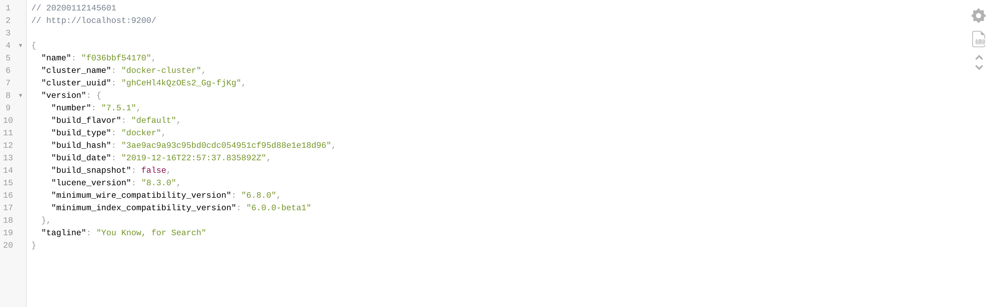

1/ Increase vm.max_map_count kernel setting value on the server(laptop) where you are going to run this example
The vm.max_map_count setting should be set permanently in /etc/sysctl.conf:
```
grep vm.max_map_count /etc/sysctl.conf
vm.max_map_count=262144
```
To apply the setting on a live system, run:
```
sudo sysctl -w vm.max_map_count=262144
```

2/ Start elasticsearch with 1 node

```
$ docker-compose -f docker-compose-single-node.yml up -d
Creating network "elasticsearch_network" with the default driver
Creating volume "elasticsearch_elasticsearch-data" with default driver
Pulling elasticsearch (elasticsearch:7.5.1)...
Creating elasticsearch_elasticsearch_1 ... done
```

3/ Check that elasticsearch is up and running
```
$ docker-compose -f docker-compose-single-node.yml ps
            Name                           Command               State                       Ports                     
-----------------------------------------------------------------------------------------------------------------------
elasticsearch_elasticsearch_1   /usr/local/bin/docker-entr ...   Up      0.0.0.0:9200->9200/tcp, 0.0.0.0:9300->9300/tcp
```

5/ Check elasticsearch logs
```
$ docker-compose -f docker-compose-single-node.yml logs -f elasticsearch
...
elasticsearch_1  | {"type": "server", "timestamp": "2020-01-12T11:55:14,181Z", "level": "INFO", "component": "o.e.a.s.m.TransportMasterNodeAction", "cluster.name": "docker-cluster", "node.name": "f036bbf54170", "message": "adding index lifecycle policy [slm-history-ilm-policy]", "cluster.uuid": "ghCeHl4kQzOEs2_Gg-fjKg", "node.id": "__j6i06ETkmHpa_UUJtrIQ"  }
elasticsearch_1  | {"type": "server", "timestamp": "2020-01-12T11:55:14,280Z", "level": "INFO", "component": "o.e.l.LicenseService", "cluster.name": "docker-cluster", "node.name": "f036bbf54170", "message": "license [0ebac9f6-f07c-404a-9d6a-f10240a3a4f1] mode [basic] - valid", "cluster.uuid": "ghCeHl4kQzOEs2_Gg-fjKg", "node.id": "__j6i06ETkmHpa_UUJtrIQ"  }
elasticsearch_1  | {"type": "server", "timestamp": "2020-01-12T11:55:14,281Z", "level": "INFO", "component": "o.e.x.s.s.SecurityStatusChangeListener", "cluster.name": "docker-cluster", "node.name": "f036bbf54170", "message": "Active license is now [BASIC]; Security is disabled", "cluster.uuid": "ghCeHl4kQzOEs2_Gg-fjKg", "node.id": "__j6i06ETkmHpa_UUJtrIQ"  }
```

6/ Visit `http://localhost:9200/` in your favourite browser to check elasticsearch metadata.


7/ Stop elasticsearch
```
$ docker-compose -f docker-compose-single-node.yml stop
Stopping elasticsearch_elasticsearch_1 ... done
```

8/ Delete created containers, networks & volumes
```
$ docker-compose -f docker-compose-single-node.yml down -v
Removing elasticsearch_elasticsearch_1 ... done
Removing network elasticsearch_network
Removing volume elasticsearch_elasticsearch-data
```
