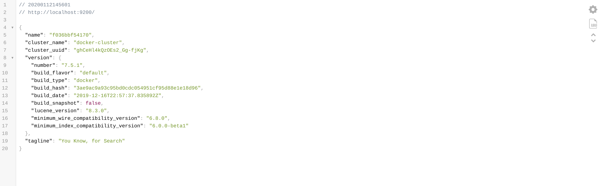

1/ Create [docker swarm](../readme/DOCKER_SWARM.md)

2/ Increase vm.max_map_count kernel setting value on the server(laptop) where you are going to run this example
The vm.max_map_count setting should be set permanently in /etc/sysctl.conf:
```
grep vm.max_map_count /etc/sysctl.conf
vm.max_map_count=262144
```
To apply the setting on a live system, run:
```
sudo sysctl -w vm.max_map_count=262144
```

3/ Deploy elasticsearch with 1 node
```
$ docker stack deploy -c docker-stack-single-node.yml twistedfantasy-elasticsearch
Creating network twistedfantasy-elasticsearch_network
Creating service twistedfantasy-elasticsearch_elasticsearch
```

4/ Check list of stacks
```
$ docker stack ls
NAME                           SERVICES            ORCHESTRATOR
twistedfantasy-elasticsearch   1                   Swarm
```

5/ Check the list of tasks in the stack
```
$ docker stack ps twistedfantasy-elasticsearch
ID                  NAME                                           IMAGE                 NODE                DESIRED STATE       CURRENT STATE            ERROR               PORTS
qz3iu1n2q0sh        twistedfantasy-elasticsearch_elasticsearch.1   elasticsearch:7.5.1   dekabrist           Running             Running 26 seconds ago     
```

6/ Check list of services in the stack
```
$ docker stack services twistedfantasy-elasticsearch
ID                  NAME                                         MODE                REPLICAS            IMAGE                 PORTS
0pr70464fysr        twistedfantasy-elasticsearch_elasticsearch   replicated          1/1                 elasticsearch:7.5.1   *:9200->9200/tcp, *:9300->9300/tcp
```

7/ Check elasticsearch service logs
```
$ docker service logs -f twistedfantasy-elasticsearch_elasticsearch
...
twistedfantasy-elasticsearch_elasticsearch.1.qz3iu1n2q0sh@dekabrist    | {"type": "server", "timestamp": "2020-01-12T12:10:26,969Z", "level": "INFO", "component": "o.e.a.s.m.TransportMasterNodeAction", "cluster.name": "docker-cluster", "node.name": "44124fe1883b", "message": "adding index lifecycle policy [slm-history-ilm-policy]", "cluster.uuid": "gw2WD3dpSNiOc5IRpFWDeg", "node.id": "jtzvEzPART-P-Uhh5LRy2g"  }
twistedfantasy-elasticsearch_elasticsearch.1.qz3iu1n2q0sh@dekabrist    | {"type": "server", "timestamp": "2020-01-12T12:10:27,131Z", "level": "INFO", "component": "o.e.l.LicenseService", "cluster.name": "docker-cluster", "node.name": "44124fe1883b", "message": "license [e7825e26-fef5-45dc-b7f5-1dc60c4a062e] mode [basic] - valid", "cluster.uuid": "gw2WD3dpSNiOc5IRpFWDeg", "node.id": "jtzvEzPART-P-Uhh5LRy2g"  }
twistedfantasy-elasticsearch_elasticsearch.1.qz3iu1n2q0sh@dekabrist    | {"type": "server", "timestamp": "2020-01-12T12:10:27,133Z", "level": "INFO", "component": "o.e.x.s.s.SecurityStatusChangeListener", "cluster.name": "docker-cluster", "node.name": "44124fe1883b", "message": "Active license is now [BASIC]; Security is disabled", "cluster.uuid": "gw2WD3dpSNiOc5IRpFWDeg", "node.id": "jtzvEzPART-P-Uhh5LRy2g"  }
```

8/ Visit `127.0.0.1:9200` in your favourite browser to check elasticsearch metadata.



9/ Bring the stack down
```
$ docker stack rm twistedfantasy-elasticsearch
Removing service twistedfantasy-elasticsearch_elasticsearch
Removing network twistedfantasy-elasticsearch_network
```

10/ Leave [docker swarm](../../readme/DOCKER_SWARM.md)
