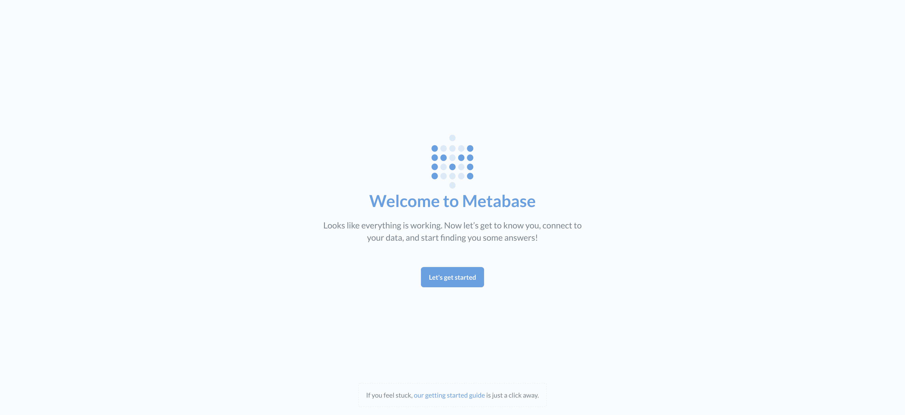
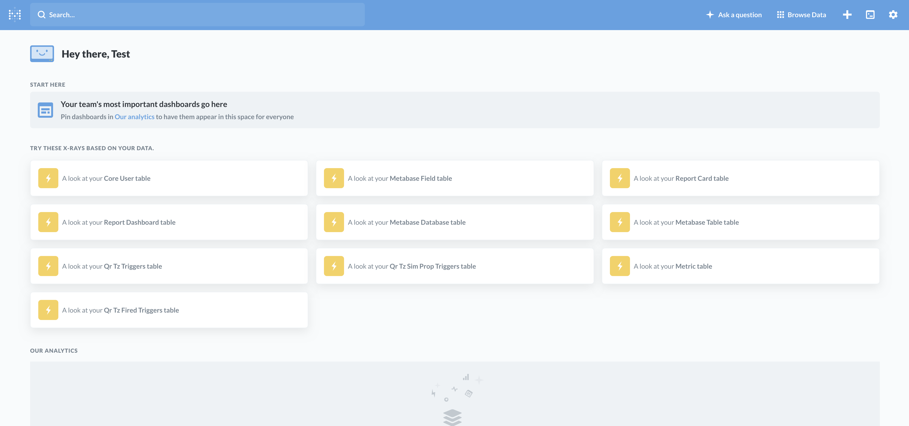

[Metabase](https://www.metabase.com/) is the easy, open source way for everyone in your company to ask questions and 
learn from data.<br/>

Features
* 5 minute setup (We're not kidding)
* Let anyone on your team ask questions without knowing SQL
* Rich beautiful dashboards with auto refresh and fullscreen
* SQL Mode for analysts and data pros
* Create canonical segments and metrics for your team to use
* Send data to Slack or email on a schedule with Pulses
* View data in Slack anytime with MetaBot
* Humanize data for your team by renaming, annotating and hiding fields
* For more information check out metabase.com

Supported databases
* Postgres
* MySQL
* Druid
* SQL Server
* Redshift
* MongoDB
* Google BigQuery
* SQLite
* H2
* Oracle
* Vertica
* Presto
* Snowflake
* SparkSQL

### Local Development
1/ Start metabase with postgresql

```
$ docker-compose -f docker-compose.yml up -d
Creating network "metabase_network" with the default driver
Creating volume "metabase_postgres-data" with default driver
Pulling metabase (metabase/metabase:v0.34.0)...
Pulling postgres (postgres:12.1-alpine)...
Creating metabase_metabase_1 ... done
Creating metabase_postgres_1 ... done
```

2/ Check that metabase with postgresql are up and running
```
$ docker-compose -f docker-compose.yml ps
       Name                      Command              State           Ports         
------------------------------------------------------------------------------------
metabase_metabase_1   /app/run_metabase.sh            Up      0.0.0.0:3000->3000/tcp
metabase_postgres_1   docker-entrypoint.sh postgres   Up      0.0.0.0:5432->5432/tcp
```

3/ Visit `localhost:3000` in your favourite browser to check metabase UI. Click `Let's get started` button
in order to go through configuration steps.


4/ Metabase dashboard


5/ Stop metabase and postgres
```
$ docker-compose -f docker-compose.yml stop
Stopping metabase_metabase_1 ... done
Stopping metabase_postgres_1 ... done
```

5/ Delete created containers, networks & volumes
```
$ docker-compose -f docker-compose.yml down -v
Removing metabase_metabase_1 ... done
Removing metabase_postgres_1 ... done
Removing network metabase_network
Removing volume metabase_postgres-data
```

### Docker Swarm

1/ Create [docker swarm](../readme/DOCKER_SWARM.md)

2/ Deploy metabase and postgres services in docker swarm
```
$ docker stack deploy -c docker-stack.yml twistedfantasy-metabase
Creating network twistedfantasy-metabase_network
Creating service twistedfantasy-metabase_metabase
Creating service twistedfantasy-metabase_postgres
```

3/ Check list of stacks
```
$ docker stack ls
NAME                      SERVICES            ORCHESTRATOR
twistedfantasy-metabase   2                   Swarm
```

4/ Check the list of tasks in the stack
```
$ docker stack ps twistedfantasy-metabase
ID                  NAME                                 IMAGE                       NODE                DESIRED STATE       CURRENT STATE           ERROR               PORTS
i0o7f0atjtcc        twistedfantasy-metabase_postgres.1   postgres:12.1-alpine        dekabrist           Running             Running 2 minutes ago                       
6zwpx9310x2u        twistedfantasy-metabase_metabase.1   metabase/metabase:v0.34.0   dekabrist           Running             Running 2 minutes ago                       
kt53o1wh9bv6        twistedfantasy-metabase_metabase.2   metabase/metabase:v0.34.0   dekabrist           Running             Running 2 minutes ago          Running             Running 21 seconds ago
```

5/ Check list of services in the stack
```
$ docker stack services twistedfantasy-metabase
ID                  NAME                               MODE                REPLICAS            IMAGE                       PORTS
mvxpyxz9bymk        twistedfantasy-metabase_metabase   replicated          2/2                 metabase/metabase:v0.34.0   *:3000->3000/tcp
yqyktu4uy5fb        twistedfantasy-metabase_postgres   replicated          1/1                 postgres:12.1-alpine        *:5432->5432/tcp
```

6/ Visit `localhost:3000` in your favourite browser to check metabase UI. Click `Let's get started` button
in order to go through configuration steps.


7/ Metabase dashboard


8/ Bring the stack down
```
$ docker stack rm twistedfantasy-metabase
Removing service twistedfantasy-metabase_metabase
Removing service twistedfantasy-metabase_postgres
Removing network twistedfantasy-metabase_network
```

9/ Leave [docker swarm](../readme/DOCKER_SWARM.md)

### Useful resources: <br/>
* [hub.docker.com](https://hub.docker.com/r/metabase/metabase)
* [github.com](https://github.com/metabase/metabase/)
* [official website](https://www.metabase.com/)
