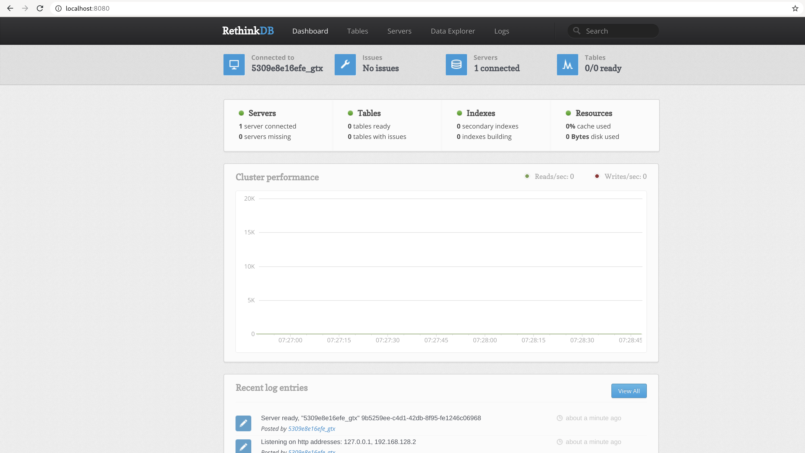

[RethinkDB](https://rethinkdb.com/) pushes JSON to your apps in realtime.
When your app polls for data, it becomes slow, unscalable, and cumbersome to maintain.
RethinkDB is the open-source, scalable database that makes building realtime apps dramatically easier.

### Local Development
1/ Start rethinkdb

```
$ docker-compose -f docker-compose.yml up -d
Creating network "rethinkdb_network" with the default driver
Creating volume "rethinkdb_rethinkdb-data" with default driver
Pulling rethinkdb (rethinkdb:2.4.0)...
Creating rethinkdb_rethinkdb_1 ... done
```

2/ Check that rethinkdb is up and running
```
$ docker-compose -f docker-compose.yml ps
        Name                  Command          State                      Ports                    
---------------------------------------------------------------------------------------------------
rethinkdb_rethinkdb_1   rethinkdb --bind all   Up      28015/tcp, 29015/tcp, 0.0.0.0:8080->8080/tcp
```

3/ Open `localhost:8080` in browser to check rethinkdb UI


4/ Stop rethinkdb
```
$ docker-compose -f docker-compose.yml stop
Stopping rethinkdb_rethinkdb_1 ... done
```

5/ Delete created containers, networks & volumes
```
$ docker-compose -f docker-compose.yml down -v
Removing rethinkdb_rethinkdb_1 ... done
Removing network rethinkdb_network
Removing volume rethinkdb_rethinkdb-data
```

### Docker Swarm

1/ Create [docker swarm](../readme/DOCKER_SWARM.md)

2/ Deploy services in docker swarm
```
$ docker stack deploy -c docker-stack.yml twistedfantasy-rethinkdb
Creating network twistedfantasy-rethinkdb_network
Creating service twistedfantasy-rethinkdb_rethinkdb
```

3/ Check list of stacks
```
$ docker stack ls
NAME                       SERVICES            ORCHESTRATOR
twistedfantasy-rethinkdb   1                   Swarm
```

4/ Check the list of tasks in the stack
```
$ docker stack ps twistedfantasy-rethinkdb
ID                  NAME                                   IMAGE               NODE                DESIRED STATE       CURRENT STATE            ERROR               PORTS
difxazs61lw1        twistedfantasy-rethinkdb_rethinkdb.1   rethinkdb:2.4.0     dekabrist           Running             Running 22 seconds ago  
```

5/ Check list of services in the stack
```
$ docker stack services twistedfantasy-rethinkdb
ID                  NAME                                 MODE                REPLICAS            IMAGE               PORTS
qfkheq29yxjp        twistedfantasy-rethinkdb_rethinkdb   replicated          1/1                 rethinkdb:2.4.0     *:8080->8080/tcp
```

6/ Check logs of registry service
```
$ docker service logs -f twistedfantasy-rethinkdb_rethinkdb
```

7/ Open `127.0.0.1:8080` in browser to check rethinkdb UI


8/ Bring the stack down
```
$ docker stack rm twistedfantasy-rethinkdb
```

9/ Leave [docker swarm](../readme/DOCKER_SWARM.md)

### Useful resources: <br/>
* [hub.docker.com](https://hub.docker.com/_/rethinkdb)
* [github.com](https://github.com/rethinkdb/rethinkdb)
* [official website](https://rethinkdb.com/__)
